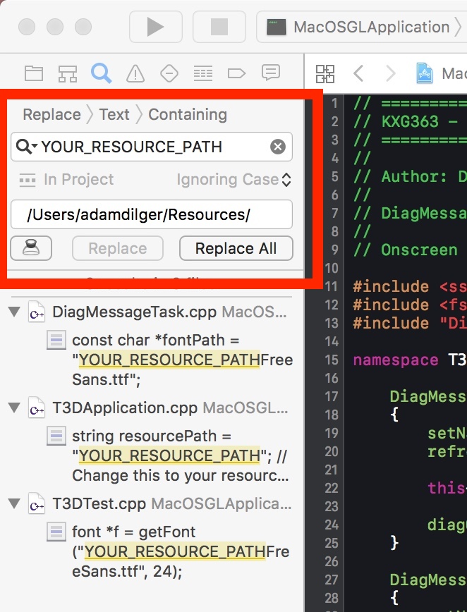

# T3DmacOS
An OSX XCode implementation of the T3D Graphics Engine

# Issues
1. No Sound (simple fix)
2. Not all keyboard keys work
3. Some lines of code commented out
  1. line 61 : Bone.cpp <transform.setLocalRotation>
  2. line 30 : SweepPath.cpp <transform.setLocalRotation>
4. Resources have to have the absolute filepath in order to load correctly

# Installation
1. Move all contents of the Frameworks directory to /Library/Frameworks/
2. Add your resource directory path to the project
   1. In XCode, select Find->Find and replace in Project, then replace YOUR_RESOURCE_PATH with the path to the /Resource directory. Make sure to add both the start and end slashes!
   2. Hit Replace All!

eg. I copied the /MacOSGLApplication/Resources/ directory to my home directory in order to make it easier to reference.
  

